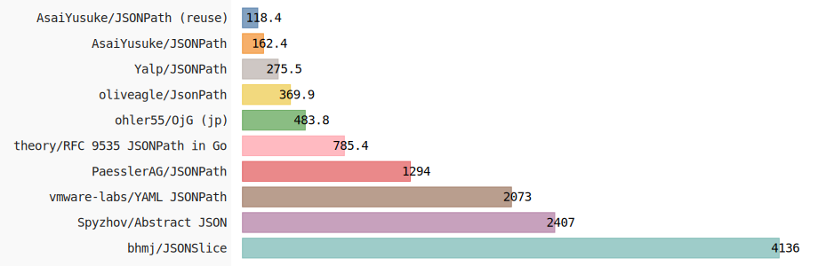

# JSONPath Benchmark

[](https://github.com/AsaiYusuke/jsonpath-benchmark/actions/workflows/build.yml)

This project benchmarks multiple JSONPath libraries written in Go.
It evaluates performance in specific scenarios and offers guidance for selecting an appropriate library.

## Contents

- [Overview](#overview)
- [Libraries Benchmarked](#libraries-benchmarked)
- [Simple Query Performance](#simple-query-performance)
- [Complex Query Performance](#complex-query-performance)
- [Support Matrix](#support-matrix)
- [Conclusion](#conclusion)
- [Reproduce Locally](#reproduce-locally)
- [License](#license)

## Overview

Results are generated via GitHub Actions for consistency and automation.

The benchmark focuses on the per-operation cost after initial setup is complete.
Preparatory steps, such as parsing or preloading data, are excluded from the measurements.
Instead, it emphasizes scenarios with intensive looping or query execution within the main operation.

Results may vary with factors such as input structure, query complexity, and runtime environment.
Treat these benchmarks as a general reference and re-evaluate them periodically.

Notes on metrics:

- Time: ns/op (lower is better)
- Memory: B/op (lower is better)
- Allocations: allocs/op (lower is better)

## Libraries Benchmarked

The following libraries are included in this benchmark:

- [AsaiYusuke/JSONPath](https://github.com/AsaiYusuke/jsonpath)
- [PaesslerAG/JSONPath](https://github.com/PaesslerAG/jsonpath)
- [bhmj/JSONSlice](https://github.com/bhmj/jsonslice)
- [ohler55/OjG (jp)](https://github.com/ohler55/ojg)
- [oliveagle/JsonPath](https://github.com/oliveagle/jsonpath)
- [Spyzhov/Abstract JSON](https://github.com/spyzhov/ajson)
- [theory/RFC 9535 JSONPath in Go](https://github.com/theory/jsonpath)
- [vmware-labs/YAML JSONPath](https://github.com/vmware-labs/yaml-jsonpath)
- [Yalp/JSONPath](https://github.com/yalp/jsonpath)

## Simple Query Performance

JSONPath:

``` text
$.store.book[*].price
```

Summary:

- Query features:
  - root selector (`$`)
  - child segments (name selectors)
  - wildcard selector (`[*]`)
- Compatibility: 10/10 (all libraries)
- Fastest: `AsaiYusuke/JSONPath`

Performance Detail:

|  Rank  | Library                        |   Time (ns/op) |   Memory (B/op) |   Allocations (allocs/op) |   Relative speed (fastest = 1x) |
|:------:|:-------------------------------|---------------:|----------------:|--------------------------:|--------------------------------:|
|   1    | AsaiYusuke/JSONPath (reuse)    |         123.50 |               0 |                         0 |                           1.00x |
|   2    | AsaiYusuke/JSONPath            |         164.20 |              64 |                         1 |                           1.33x |
|   3    | Yalp/JSONPath                  |         279.30 |             160 |                         5 |                           2.26x |
|   4    | oliveagle/JsonPath             |         358.30 |             160 |                         5 |                           2.90x |
|   5    | ohler55/OjG (jp)               |         519.20 |            1264 |                         4 |                           4.20x |
|   6    | theory/RFC 9535 JSONPath in Go |         801.70 |             480 |                        20 |                           6.49x |
|   7    | PaesslerAG/JSONPath            |        1336.00 |             816 |                        29 |                          10.82x |
|   8    | vmware-labs/YAML JSONPath      |        2038.00 |            1264 |                        69 |                          16.50x |
|   9    | Spyzhov/Abstract JSON          |        2547.00 |             968 |                        30 |                          20.62x |
|   10   | bhmj/JSONSlice                 |        4425.00 |             312 |                        13 |                          35.83x |



## Complex Query Performance

JSONPath:

``` text
$..book[?(@.price > $.store.bicycle.price)]
```

Summary:

- Query features:
  - root selector (`$`)
  - descendant segment (`..`)
  - filter selector (`?()`) with comparison expression
  - path references (`@` and `$`)
  - child segments (name selectors)
- Compatibility: 6/10 (see Support Matrix)
- Fastest: `AsaiYusuke/JSONPath`

Performance Detail:

|  Rank  | Library                        |   Time (ns/op) |   Memory (B/op) |   Allocations (allocs/op) |   Relative speed (fastest = 1x) |
|:------:|:-------------------------------|---------------:|----------------:|--------------------------:|--------------------------------:|
|   1    | AsaiYusuke/JSONPath (reuse)    |        1109.00 |              80 |                         2 |                           1.00x |
|   2    | AsaiYusuke/JSONPath            |        1150.00 |              96 |                         3 |                           1.04x |
|   3    | theory/RFC 9535 JSONPath in Go |        2300.00 |             528 |                        33 |                           2.07x |
|   4    | ohler55/OjG (jp)               |        3752.00 |            6200 |                        37 |                           3.38x |
|   5    | Spyzhov/Abstract JSON          |       15523.00 |            5480 |                       223 |                          14.00x |
|   6    | bhmj/JSONSlice                 |       15815.00 |            1784 |                        38 |                          14.26x |


## Support Matrix

| Library                        | Simple query   | Complex query   |
|:-------------------------------|:---------------|:----------------|
| AsaiYusuke/JSONPath (reuse)    | ✅              | ✅               |
| AsaiYusuke/JSONPath            | ✅              | ✅               |
| PaesslerAG/JSONPath            | ✅              | ❌               |
| bhmj/JSONSlice                 | ✅              | ✅               |
| ohler55/OjG (jp)               | ✅              | ✅               |
| oliveagle/JsonPath             | ✅              | ❌               |
| Spyzhov/Abstract JSON          | ✅              | ✅               |
| theory/RFC 9535 JSONPath in Go | ✅              | ✅               |
| vmware-labs/YAML JSONPath      | ✅              | ❌               |
| Yalp/JSONPath                  | ✅              | ❌               |

## Conclusion

This benchmark compared several popular JSONPath libraries in Go and highlighted notable performance differences.
Interestingly, the simple query showed a wider performance spread than the complex one, suggesting that implementation details and variations in query syntax handling can directly impact execution speed.
Therefore, a practical evaluation should consider both feature support and raw performance.
For selecting a library in production, we strongly recommend running benchmarks tailored to your own datasets and query patterns.

## Reproduce Locally

Benchmarks are executed in GitHub Actions for consistency.
For the exact steps and current outputs, check the Actions tab and the workflow logs.
If you prefer to run locally, follow the same sequence defined in the workflow file (see [.github/workflows/build.yml](.github/workflows/build.yml)).

## License

This project is distributed under the terms of the MIT License. See [LICENSE](LICENSE) for details.
